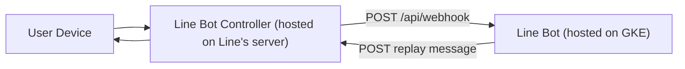
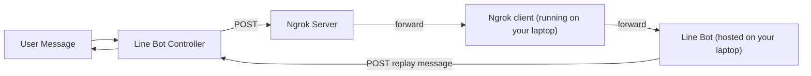

<p align="center">
  <a href="https://www.wlchurch.org.tw/" target="blank">
    
  </a>
</p>

<p align="center">
  An open-source Line bot project by JD Developers.
</p>

  <!--[](https://opencollective.com/nest#backer)
  [](https://opencollective.com/nest#sponsor)-->

## Description
A nest.js backend service for a Line bot.

## Installation

```bash
$ npm install
$ cp .env.template .env
$ # open .env and put your messaging api token
```

## Running the app

```bash
# development
$ npm run start

# watch mode
$ npm run start:dev

# production mode
$ npm run start:prod
```

## Test

```bash
# unit tests
$ npm run test

# e2e tests
$ npm run test:e2e

# test coverage
$ npm run test:cov
```

## API Documentation

The API is documented and accessible via Swagger UI. Open `localhost:3000/api` in your browser to explore the API endpoints and parameters.

API Endpoint Summary
- `POST /api/webhook`: Processes incoming messages from Line.
- Additional endpoints (if applicable)

## Architectural Diagram

### Production



### Local Development


